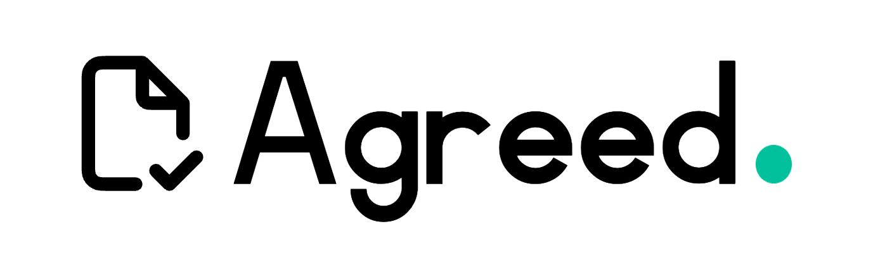
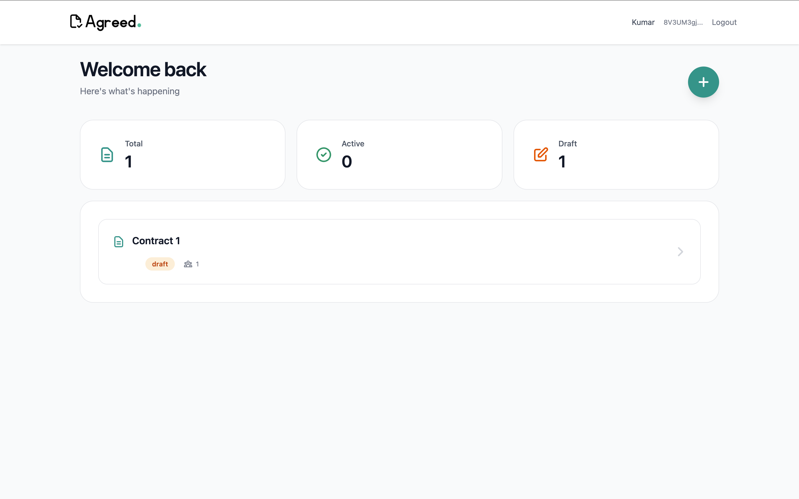
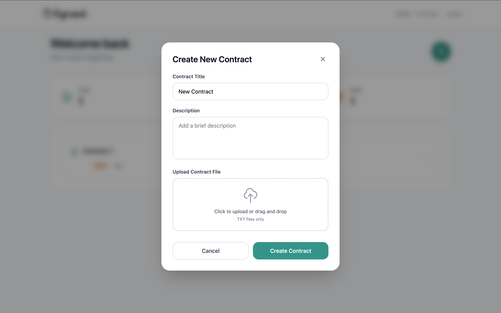
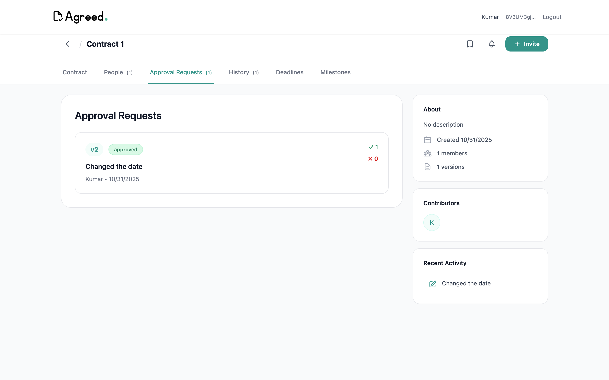
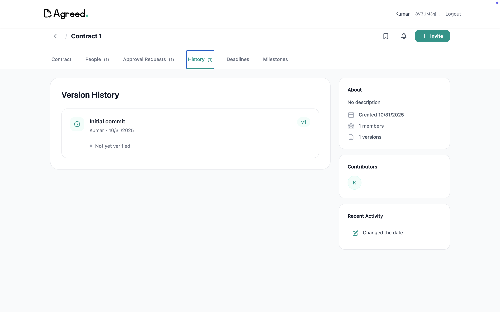

# Agreed



Agreed is a collaborative contract workspace with version history, review, comments, invitations, AI-assisted extraction, IPFS storage, and optional Solana integration. The application has a React frontend, an Express API, a SQLite database, and an Anchor program.

The project began at the Solana Cypherpunk Hackathon in 2025. Subsequent work focused on account security, contract access controls, repeatable tests, and clearer deployment configuration.

## What the application does

- Create contracts and invite participants by email or wallet address. An invitee must accept a single-use invitation before joining a contract or organization.
- Propose and review versions, compare changes, comment, and track approvals.
- Extract clauses, deadlines, and suggested payment milestones with Gemini when an API key is configured.
- Upload contract content to IPFS when Pinata is configured.
- Connect a Solana wallet for on-chain contract and reputation flows. Wallet sign-in and account linking require a signed, single-use message.

The SQLite database holds application state. IPFS and Solana are external integrations; they do not replace the database. The Anchor program includes contract approval, reputation, and SOL milestone escrow instructions. This repository does not contain evidence of a production deployment, security audit, or live escrow validation.

## Repository layout

| Path | Purpose |
| --- | --- |
| `frontend/` | React and Vite application |
| `backend/` | Express API, SQLite schema and migrations |
| `agreed_contracts/` | Anchor program and program tests |
| `.github/workflows/ci.yml` | Backend tests and frontend build |

## Run locally

Use Node.js 22 or newer. From the repository root:

```bash
cd backend
npm ci
cp .env.example .env
# Set JWT_SECRET in .env to a random value of at least 32 characters.
npm start
```

In a second terminal:

```bash
cd frontend
npm ci
npm run dev
```

The frontend runs on `http://localhost:5173` and the API on `http://localhost:3001` by default. Set `FRONTEND_URL` in the backend to the permitted frontend origin. Set `VITE_API_BASE_URL` for a frontend deployed separately from the API. `DB_PATH` can point to a separate SQLite file; otherwise the API uses `backend/database/clausebase.db`. The checked-in IDL at `agreed_contracts/idl/agreed_contracts.json` lets clean checkouts build; regenerate it with `anchor idl build --out idl/agreed_contracts.json` from `agreed_contracts/` after changing the program.

Optional services need their own credentials: `GEMINI_API_KEY` for AI, `PINATA_JWT` (or Pinata API key and secret) for IPFS, and email credentials for sending invitations. Contract creation currently depends on IPFS being available, so configure Pinata before testing that flow.

## Verify changes

```bash
cd backend && npm test
cd ../frontend && npm run build
```

The backend suite uses temporary SQLite databases and covers wallet proof and replay protection, private contract data, invitation acceptance, analysis rollback, and concurrent version edits. CI runs the backend tests, frontend build and lint, and Rust unit tests. To run the Anchor integration tests locally, install the Anchor and Solana toolchains, run `yarn install` in `agreed_contracts/`, then run `yarn test`. The test script temporarily uses a local program keypair and restores the configured program ID and checked-in IDL afterward.

## Screenshots






## Current limits

The API and frontend still rely on external services for several flows. SQLite writes are transactional, but IPFS uploads and Solana updates cannot roll back with the database; failed writes can leave orphan pins or a stale on-chain pointer. AI responses require human review. An escrow marked complete has no deadline-based refund or dispute path if approvals stall, and changes to the Anchor program require deployment and account migration before existing on-chain accounts can use them. The code and CI checks are not a security audit or a guarantee that escrow is ready for real funds.
