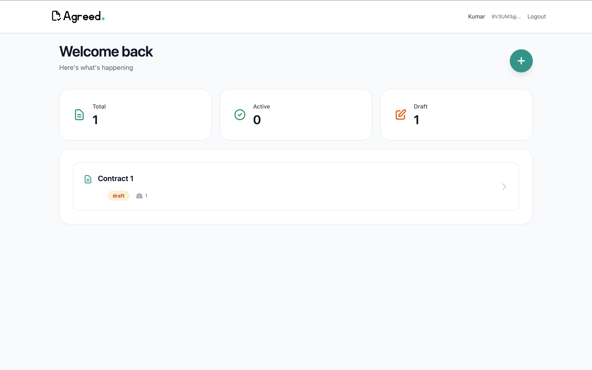
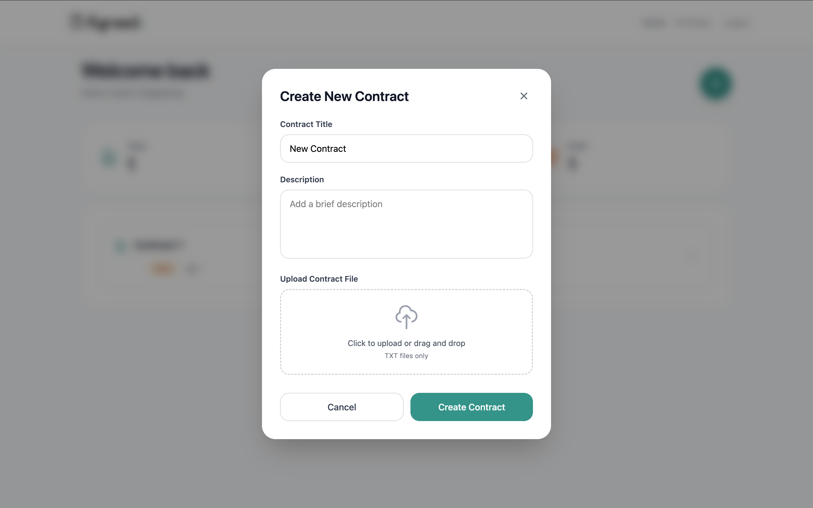
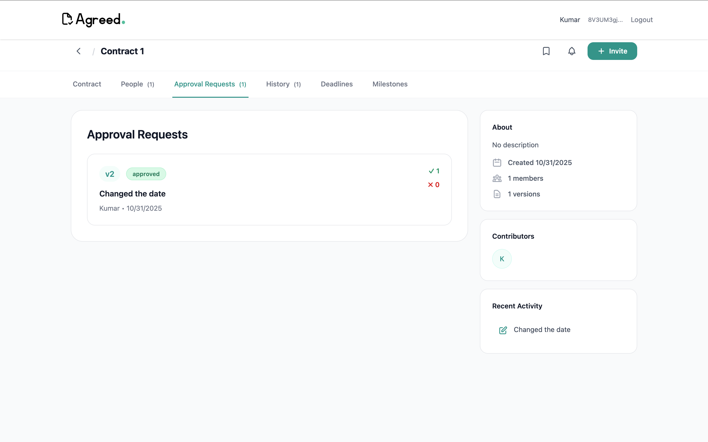

# Making Contracts Truly Smart

Agreed is a collaborative contract management platform that brings version control to legal agreements, powered by Solana blockchain for trustless coordination and cryptographic proof.

## The Problem

Contract collaboration is broken in most organizations:
- Edits scattered across email threads, Slack, and Google Docs
- No single source of truth for "who approved what and when"
- Legal and ops teams waste hours reconciling version mismatches
- Payments delayed for months due to approval ambiguity
- Companies lose ~9% of annual revenue to contract mismanagement

## The Solution

Agreed combines Git-style version control with blockchain verification:

1. **Create** - All stakeholders see the same contract version
2. **Propose** - Changes tracked with full diff history and commits
3. **Approve** - GitHub-style review flow with threaded comments
4. **Finalize** - Immutable hash stored on Solana, content on IPFS

### Key Features

- **Version Control**: Complete commit history, diff tracking, no more "final_v2_ACTUAL_final.pdf"
- **AI Assistant**: Extracts deadlines, flags risks, answers contract questions via RAG
- **Trustless Escrow**: Lock funds on contract creation, auto-release on approval threshold
- **On-Chain Reputation**: Portable contract history that follows your wallet
- **Cryptographic Proof**: Unforgeable timestamps and verification via Solana Explorer

## Technical Architecture

### Solana Integration

I'm taking full advantage of Solana's capabilities:

**Program Accounts & PDAs**
- Each contract is a Solana account with deterministic addressing
- Stores contract metadata, participants, approval status, IPFS hash
- Source of truth lives on-chain, eliminating centralized database dependencies

**IPFS Storage**
- Full contract content stored on IPFS for decentralized access
- Only cryptographic hash stored on-chain (keeps sensitive data off public ledger)
- Verifiable document integrity without exposing details

**Escrow System**
- PDA-based vault accounts lock SOL/USDC on contract creation
- Automatic release when approval threshold met
- Trustless settlement - code enforces payment, not intermediaries

**Reputation System**
- Per-wallet PDA tracking contracts created, completed, approved
- Portable on-chain credibility that transfers across platforms
- Builds verifiable business history

**Why Solana?**
- Sub-second finality for instant approval confirmations
- Fraction-of-a-cent transactions enable multiple on-chain operations
- Account model allows efficient structured state storage
- Feels like a normal app, not a "blockchain app"

### Tech Stack

**On-Chain:**
- Solana Programs (Rust + Anchor Framework)
- Deployed on Solana Devnet
- PDAs for deterministic account addressing
- Multi-signature approval logic at program level

**Off-Chain:**
- IPFS (Pinata/Web3.Storage) for document storage
- AI: Google Gemini for contract analysis
- RAG-based chatbot for contract Q&A
- Frontend: [Your framework - React/Next.js?]

**Integrations:**
- Solana Wallet Adapter (Phantom, Solflare support)
- @solana/web3.js + @coral-xyz/anchor for TypeScript client

## Architecture Diagram
```
┌─────────────────────────────────────────────────────────────┐
│                        Frontend                              │
│  (Version Control UI + AI Chat + Wallet Connection)         │
└───────────────────┬─────────────────────────────────────────┘
                    │
        ┌───────────┴───────────┐
        │                       │
        ▼                       ▼
┌───────────────┐       ┌──────────────────┐
│  IPFS Storage │       │  Solana Program  │
│               │       │                  │
│ • Documents   │       │ • Contract PDA   │
│ • Full Text   │       │ • Escrow Vault   │
│ • Encrypted   │       │ • Reputation PDA │
└───────────────┘       │ • Multi-sig      │
                        └──────────────────┘
```

## Screenshots

> Note: Paths assume this README is at the repo root and images are in `images/`.








## Program Instructions

### Core Instructions

1. **initialize_contract**
   - Creates contract account PDA
   - Sets participants and approval threshold
   - Increments creator's reputation

2. **approve_contract**
   - Records approval from participant
   - Increments approval count
   - Changes status to Completed when threshold reached
   - Updates approver's reputation

3. **initialize_reputation**
   - Creates per-wallet reputation PDA
   - Tracks contracts_created, contracts_completed, contracts_approved

4. **mark_contract_complete**
   - Updates participant reputation after contract completion
   - Called for each participant post-approval

### Account Structures

**Contract Account**
```rust
pub struct Contract {
    pub contract_id: u64,
    pub creator: Pubkey,
    pub participants: Vec<Pubkey>,
    pub escrow_amount: u64,
    pub escrow_vault: Pubkey,
    pub status: ContractStatus, // Active | Completed | Cancelled
    pub ipfs_hash: String,
    pub required_approvals: u8,
    pub current_approvals: u8,
    pub approvers: Vec<Pubkey>,
    pub created_at: i64,
    pub completed_at: Option<i64>,
    pub bump: u8,
}
```

**UserReputation Account**
```rust
pub struct UserReputation {
    pub wallet: Pubkey,
    pub contracts_created: u32,
    pub contracts_completed: u32,
    pub contracts_approved: u32,
    pub total_value_escrowed: u64,
    pub first_activity: i64,
    pub last_activity: i64,
    pub bump: u8,
}
```

## Getting Started

### Prerequisites
```bash
# Install Rust
curl --proto '=https' --tlsv1.2 -sSf https://sh.rustup.rs | sh

# Install Solana CLI
sh -c "$(curl -sSfL https://release.solana.com/stable/install)"

# Install Anchor
cargo install --git https://github.com/coral-xyz/anchor avm --locked --force
avm install latest
avm use latest
```

### Build & Deploy
```bash
# Clone repo
git clone [your-repo-url]
cd agreed

# Build Solana program
cd programs/agreed-contracts
anchor build

# Deploy to devnet
anchor deploy --provider.cluster devnet

# Run tests
anchor test
```

### Environment Setup
```bash
# Set Solana to devnet
solana config set --url devnet

# Create wallet (if needed)
solana-keygen new

# Airdrop SOL for testing
solana airdrop 2
```

## Usage Example
```typescript
import { initializeContract, approveContract, fetchContract } from './solana/client';
import { initializeReputation, fetchReputation } from './solana/reputation';

// Ensure user has reputation account
await initializeReputation(wallet);

// Create contract
const { signature, contractPDA } = await initializeContract(
  wallet,
  contractId,
  [participant1, participant2, participant3],
  2 // require 2 approvals
);

// Approve contract
await approveContract(wallet, contractId, creatorPubkey);

// Fetch contract state
const contract = await fetchContract(contractPDA);
console.log(`Status: ${contract.status}`);
console.log(`Approvals: ${contract.currentApprovals}/${contract.requiredApprovals}`);

// Fetch reputation
const rep = await fetchReputation(wallet.publicKey);
console.log(`Contracts Created: ${rep.contractsCreated}`);
```


## Why This Matters

Every contract is a promise. Right now, promises live in email threads, lawyers' desks, and people's memory. Agreed puts them in version-controlled, cryptographically-verified, immutable shared truth.

This isn't about replacing lawyers. It's about giving everyone the tools lawyers wish they had.


**Built for the Solana Cypherpunk Hackathon 2025**

*Making contracts truly smart.*
